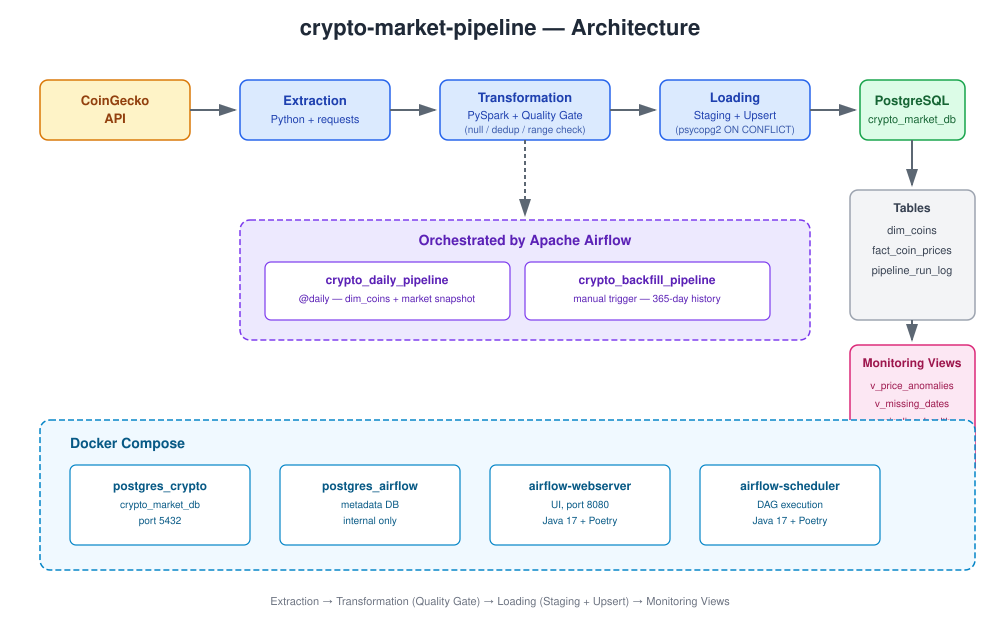
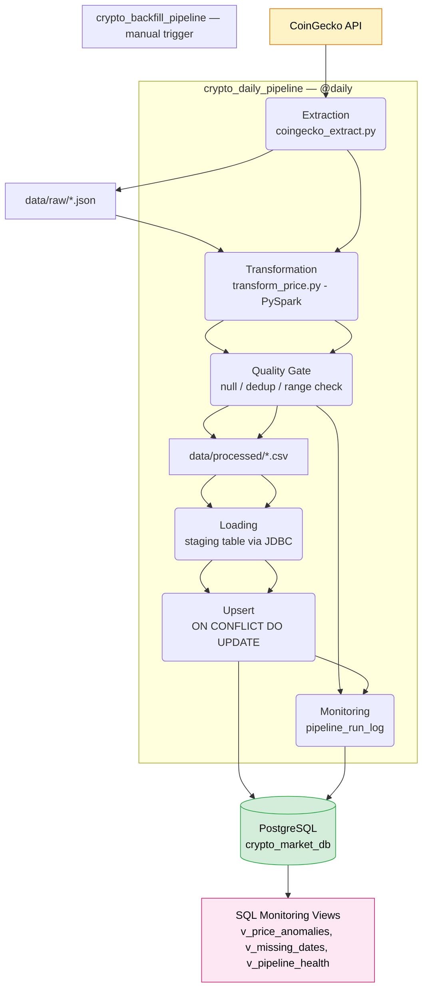
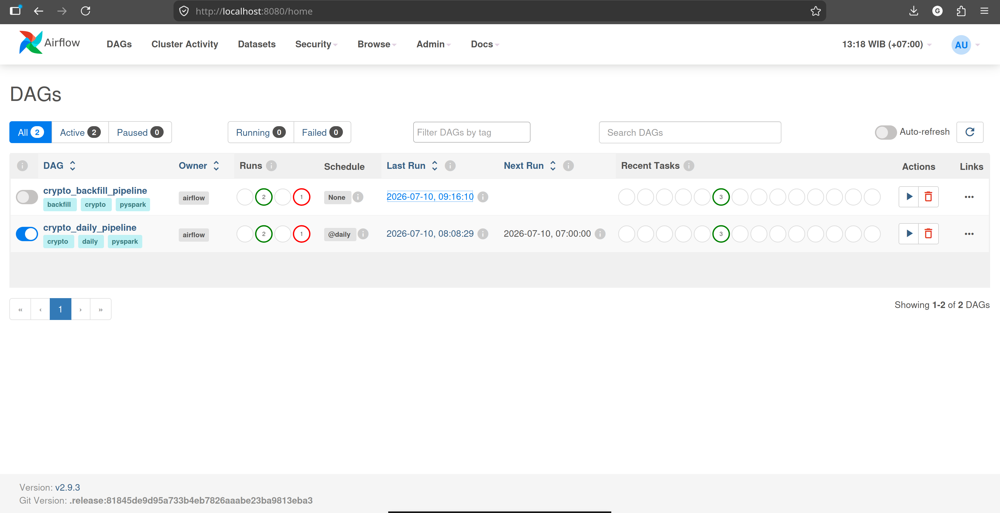
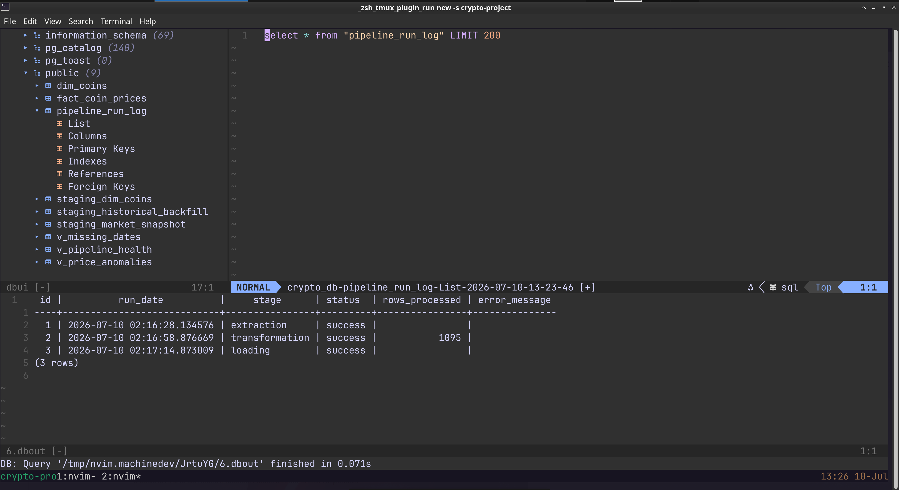

# crypto-market-pipeline

A production style, end to end data pipeline that extracts daily and historical cryptocurrency market data from the CoinGecko API, transforms and validates it with PySpark, loads results into PostgreSQL using an idempotent staging + upsert pattern, and is orchestrated by two independent Apache Airflow DAGs all fully containerized with Docker.



---

## Table of Contents

- [Overview](#overview)
- [Features](#features)
- [Architecture](#architecture)
- [Project Structure](#project-structure)
- [Tech Stack](#tech-stack)
- [Installation](#installation)
- [Configuration](#configuration)
- [Running the Pipeline](#running-the-pipeline)
- [Monitoring](#monitoring)
- [Database Schema](#database-schema)
- [CI/CD](#cicd)
- [Service URLs](#service-urls)
- [Troubleshooting](#troubleshooting)
- [License](#license)
- [Author](#author)

---

## Overview

This project ingests cryptocurrency market data from the [CoinGecko API](https://docs.coingecko.com/) and turns it into a queryable, monitored PostgreSQL dataset with a clean separation between a **daily incremental load** and a **one time historical backfill**.

Each pipeline run performs:

1. **Extract** — fetch coin metadata (`/coins/list`) and either today's price snapshot (`/coins/markets`) or 365 days of history (`/coins/{id}/market_chart`)
2. **Transform** — flatten raw JSON into a typed PySpark DataFrame, add audit columns
3. **Quality** — apply null check, deduplication, and range validation *before* any data reaches PostgreSQL
4. **Load** — write to a staging table, then upsert into the final table (`INSERT ... ON CONFLICT DO UPDATE`)
5. **Monitor** — log one row per stage per run to `pipeline_run_log`

---

## Features

- Two independent Airflow DAGs: a daily incremental load (`@daily`) and a manually triggered historical backfill each loads its own `dim_coins` dependency, so either can run safely on a fresh database
- Three layer PySpark data quality gate (null / dedup / range) with a quantified quality score, applied *before* loading not after
- Idempotent loading via staging tables + `ON CONFLICT DO UPDATE`, safe to re-run or retry without creating duplicates
- Two fully isolated PostgreSQL instances application data and Airflow metadata never share a database
- SQL monitoring views for price anomaly detection, missing-date detection, and pipeline health
- Fully containerized with Docker Compose Airflow image built with Poetry + Java 17 for PySpark compatibility
- CI (lint + type check) and CD (Docker image build & publish) via GitHub Actions

---

## Architecture



See [`docs/erd-diagram.svg`](docs/erd-diagram.svg) for the full database schema diagram.

---

## Project Structure

```
crypto-market-pipeline/
│
├── .github/
│   └── workflows/
│       ├── lint.yml                   ← CI: black, isort, ruff, mypy on every push
│       └── cd.yml                     ← CD: build & push Docker image to GHCR
│
├── dags/
│   ├── crypto_daily_pipeline.py       ← @daily: dim_coins + market snapshot
│   └── crypto_backfill_pipeline.py    ← manual trigger: dim_coins + 365-day history
│
├── src/
│   ├── utils/
│   │   ├── config.py                  ← environment variable loader
│   │   └── logger.py                  ← console + file logger
│   ├── extraction/
│   │   └── coingecko_extract.py       ← CoinGecko API calls (daily + backfill variants)
│   ├── transformation/
│   │   └── transform_price.py         ← PySpark transform, includes quality gate
│   ├── loading/
│   │   ├── load_postgres.py           ← Spark JDBC → staging tables
│   │   └── staging_upsert.py          ← psycopg2 upsert → final tables
│   └── quality/
│       └── quality_data.py            ← null/dedup/range checks + run logging
│
├── postgres/
│   └── sql/
│       ├── 01_schema.sql              ← tables, constraints, foreign keys
│       └── 02_views.sql               ← monitoring views
│
├── docs/
│   ├── architecture-diagram.svg
│   ├── erd-diagram.svg
│   └── screenshots/
│       ├── airflow-dag-success.png
│       └── query-results.png
│
├── data/                               ← gitignored: raw/processed CSV & JSON staging
├── logs/                               ← gitignored: pipeline log files
├── Dockerfile                          ← Airflow image with Poetry + Java 17
├── docker-compose.yml
├── pyproject.toml
├── .env.example
└── LICENSE
```

---

## Tech Stack

| Layer | Technology | Version |
|---|---|---|
| Language | Python | 3.12 |
| Dependency management | Poetry | — |
| Data source | CoinGecko API | Demo tier |
| Processing | Apache PySpark | 4.1.2 |
| Database | PostgreSQL | 16 |
| Orchestration | Apache Airflow (TaskFlow API) | 2.9.3 |
| Runtime (for PySpark) | OpenJDK | 17 |
| Containerization | Docker + Docker Compose | — |
| Code quality | black, isort, ruff, mypy, pre-commit | — |
| CI/CD | GitHub Actions + GHCR | — |

---

## Installation

### Prerequisites

| Requirement | Minimum Version | Notes |
|---|---|---|
| Docker | 24.0+ | Engine + CLI |
| Docker Compose | 2.20+ (tested on 2.40.2) | `docker-compose-plugin` package on Linux no Docker Desktop required |
| Git | any | For cloning the repo |
| Poetry | 1.8+ | Optional, only needed for local development outside containers |

### Step-by-Step Setup

**1. Clone the repository**

```bash
git clone git@github.com:gladytdavianus/crypto-market-pipeline.git
cd crypto-market-pipeline
```

**2. Configure environment variables**

```bash
cp .env.example .env
echo "AIRFLOW_UID=$(id -u)" >> .env
```

Edit `.env` and fill in your own values: `DB_PASSWORD`, `COINGECKO_API_KEY` (free — [register here](https://www.coingecko.com/en/developers/dashboard)), and `AIRFLOW__WEBSERVER__SECRET_KEY` (generate with `python3 -c "import secrets; print(secrets.token_hex(16))"`).

**3. Build and start all services**

```bash
docker compose up -d --build
```

The first build installs Java 17 and all Poetry dependencies inside the Airflow image this takes a few minutes. Subsequent starts are fast.

**4. Verify all containers are healthy**

```bash
docker ps
```

You should see `postgres_crypto`, `airflow_postgres`, `airflow webserver`, and `airflow-scheduler` all `Up`.

**5. Apply the database schema (automatic on first run)**

The schema and views in `postgres/sql/` are applied automatically the first time `postgres_crypto` starts, via Docker's `docker-entrypoint-initdb.d` mechanism. To re-apply manually (e.g. after adding a new view):

```bash
docker exec -i crypto_postgres psql -U crypto_user -d crypto_market_db < postgres/sql/02_views.sql
```

---

## Configuration

### Environment Variables (`.env`)

| Variable | Description |
|---|---|
| `DB_HOST` | `localhost` for local Poetry runs, overridden to `postgres_crypto` inside Docker |
| `DB_PORT` | PostgreSQL port (default `5432`) |
| `DB_NAME` | Application database name (`crypto_market_db`) |
| `DB_USER` / `DB_PASSWORD` | Application database credentials |
| `COINGECKO_BASE_URL` | `https://api.coingecko.com/api/v3` |
| `COINGECKO_API_KEY` | Free CoinGecko Demo API key |
| `AIRFLOW__WEBSERVER__SECRET_KEY` | Random secret for Airflow session security |
| `AIRFLOW_UID` | Host user ID — prevents file permission errors on mounted `dags/`, `data/`, `logs/` volumes |

### Backfill coin selection (`src/extraction/coingecko_extract.py`)

```python
def extract_backfill(coin_ids: list[str] | None = None, days: int = 365):
    if coin_ids is None:
        coin_ids = ["bitcoin", "ethereum", "solana"]
```

Change the default list (or pass `coin_ids` explicitly) to backfill different coins.

---

## Running the Pipeline

### Trigger manually via CLI

```bash
# One-time historical backfill (run this first on a fresh database)
docker exec -it crypto-market-pipeline-airflow-scheduler-1 \
  airflow dags trigger crypto_backfill_pipeline

# Daily snapshot (also runs automatically every day)
docker exec -it crypto-market-pipeline-airflow-scheduler-1 \
  airflow dags trigger crypto_daily_pipeline
```

### Monitor via Airflow UI

Open `http://localhost:8080` (login: `admin` / `admin`). Both DAGs start **paused**  unpause them from the UI before triggering or waiting for the schedule.



---

## Monitoring

Pipeline health is tracked in PostgreSQL rather than a separate dashboard tool every stage of every run writes one row to `pipeline_run_log`.

```sql
-- Overall health summary per stage
SELECT * FROM v_pipeline_health;

-- Detect abnormal day-over-day price jumps
SELECT * FROM v_price_anomalies WHERE ABS(pct_change) > 20 ORDER BY price_date DESC;

-- Detect gaps where the daily pipeline may have failed to run
SELECT * FROM v_missing_dates ORDER BY expected_date DESC LIMIT 20;
```



---

## Database Schema

### Tables

**`dim_coins`** — coin metadata, sourced from `/coins/list`

| Column | Type | Description |
|---|---|---|
| `coin_id` | VARCHAR(100), PK | CoinGecko coin identifier |
| `symbol` | VARCHAR(100) | Ticker symbol |
| `name` | VARCHAR(300) | Full coin name |
| `loaded_at` | TIMESTAMP | When this row was last refreshed |

**`fact_coin_prices`** — daily price time-series, sourced from both `/coins/markets` and `/coins/{id}/market_chart`

| Column | Type | Description |
|---|---|---|
| `id` | SERIAL, PK | Surrogate key |
| `coin_id` | VARCHAR(100), FK → `dim_coins` | Coin identifier |
| `price_date` | DATE | Date this price applies to |
| `price_usd` | NUMERIC(20,8) | Price in USD |
| `market_cap_usd` | NUMERIC(20,2) | Market cap (snapshot rows only) |
| `volume_24h_usd` | NUMERIC(20,2) | 24h volume (snapshot rows only) |
| `processed_at` | TIMESTAMP | When this row was processed |

`UNIQUE (coin_id, price_date)` keeps the daily snapshot and historical backfill consistent in the same table without duplicates.

**`pipeline_run_log`**  one row per pipeline stage per run

| Column | Type | Description |
|---|---|---|
| `stage` | VARCHAR, CHECK IN (`extraction`, `transformation`, `loading`) | Which stage ran |
| `status` | VARCHAR, CHECK IN (`running`, `success`, `failed`) | Outcome |
| `rows_processed` | INTEGER | Row count where applicable |
| `error_message` | TEXT | Captured exception message on failure |

### Views

| View | Description |
|---|---|
| `v_price_anomalies` | Day-over-day price change % per coin, using `LAG()` |
| `v_missing_dates` | Dates missing from `fact_coin_prices`, via `generate_series` + `LEFT JOIN` |
| `v_pipeline_health` | Aggregated run count, last run time, and rows processed per stage |

---

## CI/CD

This project uses two separate GitHub Actions workflows:

| Workflow | File | Trigger | What it does |
|---|---|---|---|
| **CI** | `.github/workflows/lint.yml` | Every push / PR | Runs `black`, `isort`, `ruff`, and `mypy` against the codebase |
| **CD** | `.github/workflows/cd.yml` | After CI succeeds on `main` | Builds the Docker image and publishes it to GitHub Container Registry (GHCR) |

Because this pipeline requires long-running containers (Airflow scheduler, PostgreSQL) rather than a stateless web service, "deployment" here means **publishing a versioned, ready to run Docker image** not deploying to an always on server. Anyone can pull and run the exact tested image with:

```bash
docker pull ghcr.io/gladytdavianus/crypto-market-pipeline:latest
```

---

## Service URLs

| Service | URL | Credentials |
|---|---|---|
| Airflow UI | http://localhost:8080 | `admin` / `admin` |
| PostgreSQL (application) | `localhost:5432` | `crypto_user` / value of `DB_PASSWORD` |
| PostgreSQL (Airflow metadata) | internal only, not exposed to host | — |

---

## Troubleshooting

### 1. `Py4JJavaError: 'JavaPackage' object is not callable`

**Cause:** A stale `JAVA_HOME` or `SPARK_HOME` environment variable (left over from a different project) pointing to an incompatible Java/Spark version. PySpark 4.x requires Java 17+.

**Solution:** Check for conflicting variables in your shell config and unset them:
```bash
grep -rn "JAVA_HOME\|SPARK_HOME" ~/.zshrc ~/.config/zsh/
```
Inside the container, this is handled explicitly in the Dockerfile:
```dockerfile
RUN apt-get install -y openjdk-17-jdk-headless
ENV JAVA_HOME=/usr/lib/jvm/java-17-openjdk-amd64
```

---

### 2. `PermissionError: [Errno 13] Permission denied: '/opt/airflow/logs/scheduler'`

**Cause:** The container's Airflow user UID doesn't match the host user that owns the mounted `logs/`/`dags/` folders.

**Solution:** Set `AIRFLOW_UID` to match your host user, and ensure mounted folders are writable:
```bash
echo "AIRFLOW_UID=$(id -u)" >> .env
mkdir -p dags data logs && chmod -R 777 dags data logs
```

---

### 3. `insert or update on table "fact_coin_prices" violates foreign key constraint`

**Cause:** `fact_coin_prices` has a foreign key to `dim_coins`. If a DAG loads price data without first ensuring `dim_coins` is populated (e.g. running the backfill DAG on a fresh database), the insert fails.

**Solution:** Both `crypto_daily_pipeline` and `crypto_backfill_pipeline` independently load `dim_coins` before touching `fact_coin_prices`, so either can run first on a fresh database.

---

### 4. `ON CONFLICT DO UPDATE command cannot affect row a second time`

**Cause:** CoinGecko's `/market_chart` endpoint occasionally returns intraday (hourly) granularity for recent dates, producing more than one row for the same `(coin_id, price_date)` within a single staging table which `ON CONFLICT` cannot resolve within one statement.

**Solution:** Deduplicate before the upsert, either in the quality layer (`dropDuplicates(["coin_id", "price_date"])`) or in the upsert query itself using `SELECT DISTINCT ON (coin_id, price_date) ... ORDER BY processed_at DESC`.

---

### 5. `FileNotFoundException: .../dim_coins/_temporary/0 does not exist`

**Cause:** Two Spark jobs (e.g. the daily and backfill DAGs) writing to the *same* local CSV output folder at nearly the same time one job's `overwrite` mode deletes the temporary directory the other job is still using.

**Solution:** Give each DAG its own output subfolder for shared staging steps (e.g. `dim_coins_daily/` vs `dim_coins_backfill/`), even though both ultimately upsert into the same `dim_coins` table.

---

### 6. Docker volume reset after changing `docker-compose.yml`

**Cause:** Renaming a service or its associated volume in `docker-compose.yml` causes Docker to treat it as a brand new volume silently resetting all previously loaded data.

**Solution:** This is exactly why the loading layer uses staging + upsert rather than plain insert: re-running the backfill DAG safely restores the data with no manual intervention needed.

---

## License

This project is licensed under the MIT License see the [LICENSE](LICENSE) file for details.

---

## Author

> Built and maintained by **Glady T. Davianus** Instrument & Control Engineer transitioning into Data Engineering.

GitHub: [https://github.com/gladytdavianus](https://github.com/gladytdavianus)

> Contributions and pull requests are welcome.

---

## Acknowledgments

- [CoinGecko API](https://docs.coingecko.com/) — for free access to cryptocurrency market data
- [Apache Airflow](https://airflow.apache.org/) — for workflow orchestration
- [Apache Spark](https://spark.apache.org/) — for distributed data processing
- [PostgreSQL](https://www.postgresql.org/) — for the relational database

---

*Last updated: July 2026*
